# Mermaid Architecture Diagrams with Icons

## Overview

This project has the `@iconify-json/streamline-freehand-color` icon pack registered in Mermaid under the prefix **`logos`**. Use this prefix to add colorful freehand-style icons to `architecture-beta` diagrams.

## How Icons Are Registered

In [src/routes/posts/[slug]/+page.svelte](../../src/routes/posts/[slug]/+page.svelte), icons are registered on `onMount`:

```js
mermaid.registerIconPacks([
  {
    name: "logos",
    loader: () =>
      import("@iconify-json/streamline-freehand-color").then((module) => module.icons),
  },
]);
```

The `name: "logos"` is the **prefix** used in diagram syntax.

---

## Diagram Syntax

Mermaid's `architecture-beta` diagram type supports icons on services and groups:

```
architecture-beta
  service <id>(<prefix>:<icon-name>)[<label>]
  group <id>(<prefix>:<icon-name>)[<label>]
```

### Connections

```
<service-id>:<edge> <arrow> <edge>:<service-id>
```

Edges: `T` (top), `B` (bottom), `L` (left), `R` (right)  
Arrows: `-->` (directed), `--` (undirected)

---

## Examples

### Simple Web + Database

```mermaid
architecture-beta
  service browser(logos:worldwide-web-browser)[Browser]
  service api(logos:server-2)[API Server]
  service db(logos:database)[Database]

  browser:R --> L:api
  api:R --> L:db
```



### Microservices with Groups

```mermaid
architecture-beta
  group frontend(logos:programming-browser)[Frontend Layer]
  group backend(logos:server-api-cloud)[Backend Layer]
  group data(logos:database-hierarchy)[Data Layer]

  service web(logos:worldwide-web-browser)[Web App] in frontend
  service mobile(logos:smart-watch-square)[Mobile App] in frontend

  service gateway(logos:network-router-signal-1)[API Gateway] in backend
  service auth(logos:security-shield-network)[Auth Service] in backend
  service app(logos:terminal)[App Service] in backend

  service db(logos:database)[PostgreSQL] in data
  service cache(logos:cloud-storage-drive)[Redis Cache] in data
  service queue(logos:data-transfer-horizontal)[Message Queue] in data

  web:R --> L:gateway
  mobile:R --> L:gateway
  gateway:B --> T:auth
  gateway:B --> T:app
  app:B --> T:db
  app:B --> T:cache
  app:R --> L:queue
```



### Cloud Deployment

```mermaid
architecture-beta
  group cloud(logos:cloud-network-1)[Cloud Infrastructure]
  group compute(logos:server-2)[Compute]
  group storage(logos:cloud-storage-drive)[Storage]

  service cdn(logos:worldwide-web-network-www)[CDN] in cloud
  service lb(logos:network-monitor-transfer-arrow-1)[Load Balancer] in compute
  service api1(logos:terminal)[API Pod 1] in compute
  service api2(logos:terminal)[API Pod 2] in compute
  service db(logos:database)[Database] in storage
  service files(logos:cloud-data-transfer)[File Store] in storage

  cdn:B --> T:lb
  lb:B --> T:api1
  lb:B --> T:api2
  api1:R --> L:db
  api2:R --> L:db
  api1:B --> T:files
```



### CI/CD Pipeline

```mermaid
architecture-beta
  service code(logos:file-code)[Source Code]
  service ci(logos:website-development-build)[CI Runner]
  service test(logos:bug-browser-warning)[Test Suite]
  service registry(logos:cloud-check)[Container Registry]
  service deploy(logos:data-transfer-vertical)[Deploy]
  service prod(logos:server-api-cloud)[Production]

  code:R --> L:ci
  ci:R --> L:test
  test:R --> L:registry
  registry:R --> L:deploy
  deploy:R --> L:prod
```



---

## Icon Quick Reference by Use Case

### Servers & Infrastructure
| Icon name | Best for |
|-----------|----------|
| `logos:server-2` | Generic server |
| `logos:server-api-cloud` | API server |
| `logos:server-lock` | Secure server |
| `logos:terminal` | CLI / App service |
| `logos:network-router-signal-1` | Router / Gateway |
| `logos:network` | Network layer |
| `logos:network-connector` | Network link |

### Cloud & Storage
| Icon name | Best for |
|-----------|----------|
| `logos:cloud-network-1` | Cloud infrastructure |
| `logos:cloud-storage-drive` | Cloud storage / Redis |
| `logos:cloud-data-transfer` | S3 / Blob storage |
| `logos:cloud-check` | Registry / Approved |
| `logos:cloud-lock-1` | Secure cloud |
| `logos:database` | Generic database |
| `logos:database-network-1` | Networked DB |
| `logos:database-hierarchy` | DB cluster |
| `logos:database-settings` | DB config |

### Networking & Data Transfer
| Icon name | Best for |
|-----------|----------|
| `logos:data-transfer-horizontal` | Message queue / Kafka |
| `logos:data-transfer-vertical` | Deployment pipeline |
| `logos:data-transfer-sync` | Sync service |
| `logos:network-monitor-transfer-arrow-1` | Load balancer |
| `logos:worldwide-web-browser` | Browser client |
| `logos:worldwide-web-network-www` | CDN |
| `logos:worldwide-web-users` | User base |
| `logos:wifi-monitor-1` | Wireless / WiFi |

### Applications & UI
| Icon name | Best for |
|-----------|----------|
| `logos:programming-browser` | Web application |
| `logos:app-window-source-code` | Source code viewer |
| `logos:app-window-graph` | Dashboard / Monitoring |
| `logos:app-window-user` | User portal |
| `logos:website-development-browser-page-layout` | Frontend |
| `logos:website-development-build` | Build system |
| `logos:responsive-design-monitor-phone` | Multi-platform app |

### Security
| Icon name | Best for |
|-----------|----------|
| `logos:security-shield-network` | Auth / Network security |
| `logos:security-it-service` | IT security service |
| `logos:security-gdpr-browser` | Compliance layer |
| `logos:security-shield-wall` | Firewall |
| `logos:network-connection-locked` | Secure connection |
| `logos:server-lock` | Locked server |

### Monitoring & DevOps
| Icon name | Best for |
|-----------|----------|
| `logos:bug-browser-warning` | Bug tracking / Tests |
| `logos:analytics-graph-line-triple` | Metrics / Analytics |
| `logos:analytics-board-graph-line` | Dashboard |
| `logos:programming-flowchart` | Pipeline / Flow |
| `logos:programming-code-idea` | Logic / Algorithm |
| `logos:file-code` | Source file |

### Mobile & Devices
| Icon name | Best for |
|-----------|----------|
| `logos:smart-watch-square` | Mobile / Wearable |
| `logos:tablet-application` | Tablet app |
| `logos:laptop-computer-1` | Desktop client |
| `logos:desktop-monitor` | Admin console |

---

## Procedure

1. **Identify** the architecture components (services, layers, groups)
2. **Choose icons** from the Quick Reference table above or [full icon catalog](./references/icon-catalog.md)
3. **Write** the `architecture-beta` diagram block
4. **Use `logos:`** prefix for every icon reference (e.g., `logos:database`)
5. **Add connections** using `ServiceA:R --> L:ServiceB` syntax
6. **Preview** — icons render only in the browser (Mermaid runs client-side)

### Edge Direction Reference
```
         T (top)
          ↑
L (left) ← → R (right)
          ↓
         B (bottom)
```

---

## Full Icon Catalog

See [./references/icon-catalog.md](./references/icon-catalog.md) for all 1000 icons organized by category.

## Notes

- Icons only render in the browser (`onMount` in `+page.svelte`) — SSR will not render them
- The `architecture-beta` syntax is a Mermaid v11+ feature
- Each icon reference must use the exact icon name from the catalog (case-sensitive, hyphens only)
- Groups can be nested to represent layered architecture
