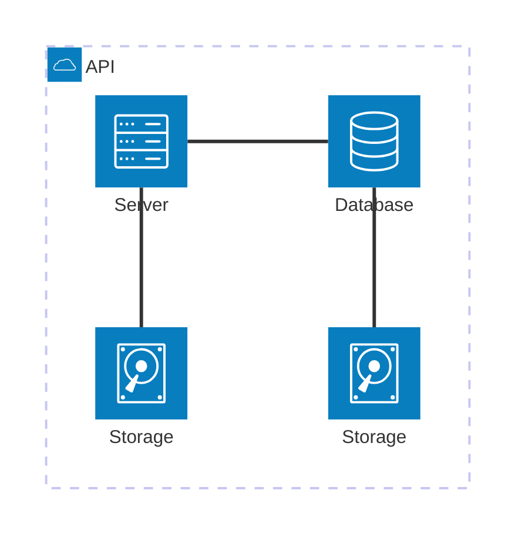
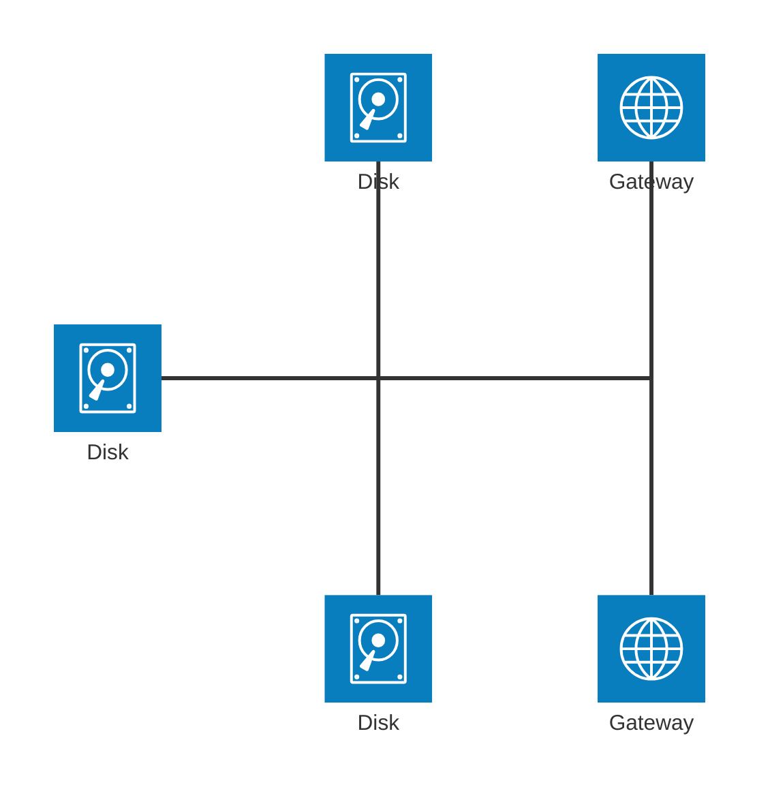

# Mermaid Flowchart Syntax Reference

This quick reference summarises key elements of the Mermaid flowchart syntax.  For a
detailed explanation and examples, consult the official documentation.

## Graph Declaration and Direction

Begin diagrams with `flowchart` (or `graph`) followed by a direction:

* `LR` – left‑to‑right
* `RL` – right‑to‑left
* `TB` / `TD` – top‑to‑bottom (default)
* `BT` – bottom‑to‑top

Example:


## Node Syntax and Shapes

Nodes are defined by an identifier and optional label.  Use bracket syntax to select
a shape:

| Syntax | Shape | Typical use |
|---|---|---|
| `A[A]` or `A` | Rectangle | Process or action |
| `A(A)` | Rounded rectangle | Soft process or sub‑process |
| `A([A])` | Stadium | Start/End or terminal |
| `A[[A]]` | Subroutine | Callable sub‑process |
| `A[(A)]` | Cylinder | Database/storage |
| `A((A))` | Circle | Start or end |
| `A{A}` | Diamond | Decision |
| `A{{A}}` | Hexagon | Preparation/condition |
| `A[/ A /]`, `A[\ A \]` | Parallelogram | Input/output |
| `A[/\ A /\]`, `A[\/ A \/]` | Trapezoid | Manual operation |
| `A(((A)))` | Double circle | Stop or terminator |

Mermaid 11.3+ supports semantic shapes with `A@{ shape: name }`.  Common shape
names include:

| Name | Meaning | Equivalent |
|---|---|---|
| `rect` | Process | rectangle |
| `rounded` | Event | rounded rectangle |
| `stadium` | Terminal | pill shape |
| `fr-rect` | Subprocess | framed rectangle |
| `cyl` | Database | cylinder |
| `circle` / `sm-circ` | Start | circle or small circle |
| `diam` | Decision | diamond |
| `hex` | Prepare/condition | hexagon |

Define a label different from the id by placing the text inside brackets or quotes:
`A["Node label"]` or `A[Label]`.  Use double quotes for Markdown strings (supports
`**bold**`, `*italic*` and automatic line wrapping).

## Edges and Links

Connect nodes using arrows and lines.  The basic forms are:

* `A --> B` – Solid line with arrow head.
* `A --- B` – Open line (no arrow head).
* `A -.-> B` – Dotted arrow.
* `A == B` / `A ==> B` – Thick line or thick arrow.
* `A -. B` – Invisible link, used only for positioning.
* `A <--> B` – Bi‑directional arrow.

Label links by inserting `|text|` after the arrow: `A -->|Yes| B`.

To increase the length of a link (forcing a longer horizontal or vertical span), add
additional characters.  Extra `-` characters lengthen normal links; extra `=`
characters lengthen thick links; extra `.` characters lengthen dotted links.

Assign an ID to an edge by prefixing it with `id@` (e.g. `e1@-->`).  IDs allow
animation and styling of specific edges.

## Subgraphs

Group nodes into subgraphs using:

```mermaid
subgraph Subgraph Title
    direction LR  %% optional
    A --> B
end
```

Subgraphs may have their own direction.  If any node in a subgraph connects to the
outside, the subgraph inherits the parent graph’s direction.

## Styling and Classes

Use `style` to apply custom CSS properties directly to a node or edge:

```mermaid
style A fill:#f9f,stroke:#333,stroke-width:2px
```

Define reusable styles with `classDef` and apply them with `class`:

```mermaid
classDef important fill:#ffdddd,stroke:#ff0000,stroke-width:2px;
class A,B important;
```

Alternatively, attach a class directly to a node using the shorthand `:::`:

```mermaid
A:::important
```

Custom CSS classes defined outside of the Mermaid code can also style nodes and
edges.  A class named `default` will apply to any node without an explicit class.

## Interaction

Make parts of a diagram interactive with the `click` directive.  Bind a node id
either to a JavaScript callback defined on the page or to a URL:

```mermaid
click nodeId callback  %% calls window.callback(nodeId)
click nodeId "https://example.com" "Tooltip" %% opens link in same tab
click nodeId "https://example.com" "Tooltip" _blank %% opens in new tab
```

This feature requires Mermaid’s `securityLevel` to be set to `loose`.

## Markdown Strings and Escaping

Enclose labels in double quotes (`"Text"`) to enable Markdown formatting.  Use
`**bold**` for bold and `*italic*` for italics.  Mermaid automatically wraps text
inside nodes.  To include special characters that might otherwise break the parser,
wrap the entire label in quotes or encode individual characters using numeric
entities (e.g. `#` can be written as `#35;`).

## Additional Tips

* End statements in graph declarations can omit semicolons; only one space is
  allowed between a vertex and its link symbol.
* The default renderer uses the Dagre layout algorithm.  For complex diagrams,
  use the ELK renderer by adding a configuration directive:

  ```mermaid
  ---
  config:
    flowchart:
      defaultRenderer: "elk"
  ---
  ```

* Mermaid CLI (`mmdc`) can convert `.mmd` files into images; the `render.sh` script
  demonstrates usage.

## Architecture diagram

> In the context of mermaid-js, the architecture diagram is used to show the relationship between services and resources commonly found within the Cloud or CI/CD deployments. In an architecture diagram, services (nodes) are connected by edges. Related services can be placed within groups to better illustrate how they are organized.

Example code:


### Syntax

The building blocks of an architecture are `groups`, `services`, `edges`, and `junctions`.

For supporting components, icons are declared by surrounding the icon name with (), while labels are declared by surrounding the text with [].

To begin an architecture diagram, use the keyword `architecture-beta`, followed by your groups, services, edges, and junctions. While each of the 3 building blocks can be declared in any order, care must be taken to ensure the identifier was previously declared by another component.

### Groups

The syntax for declaring a group is:

```
group {group id}({icon name})[{title}] (in {parent id})?
```

Put together:

```
group public_api(cloud)[Public API]
```

Additionally, groups can be placed within a group using the optional `in` keyword

```
group private_api(cloud)[Private API] in public_api
```

### Services

The syntax for declaring a service is:

```
service {service id}({icon name})[{title}] (in {parent id})?
```

Put together:

```
service database1(database)[My Database]
```

### Edges

The syntax for declaring an edge is:

```
{serviceId}{{group}}?:{T|B|L|R} {<}?--{>}? {T|B|L|R}:{serviceId}{{group}}?
```

#### Edge direction

The side of the service the edge comes out of is specified by adding a colon (`:`) to the side of the service connecting to the arrow and adding `L|R|T|B`

For example

```
db:R -- L:server
```

creates an edge between the services `db` and `server`, with the edge coming out of the right of `db` and the left of `server`.

creates a 90 degree edge between the services db and server, with the edge coming out of the top of db and the left of server.

#### Arrows

Arrows can be added to each side of an edge by adding `<` before the direction on the left, and/or `>` after the direction on the right.

For example

```
subnet:R --> L:gateway
```

#### Edges out of Groups

To have an edge go from a group to another group or service within another group, the `{group}` modifier can be added after the `serviceId`.

For example:

```
service server[Server] in groupOne
service subnet[Subnet] in groupTwo

server{group}:B --> T:subnet{group}
```

creates an `edge` going out of groupOne, adjacent to `server`, and into `groupTwo`, adjacent to `subnet`.

It's important to note that groupIds cannot be used for specifying edges and the {group} modifier can only be used for services within a group.

#### Junctions

Junctions are a special type of node which acts as a potential 4-way split between edges.

The syntax for declaring a junction is:

```
junction {junction id} (in {parent id})?
```

Code:


### Icons

By default, architecture diagram supports the following icons: `cloud`, `database`, `disk`, `internet`, `server`. Users can use any of the 200,000+ icons available in iconify.design, or add other custom icons, by [registering an icon pack](https://mermaid.ai/open-source/config/icons.html).

After the icons are installed, they can be used in the architecture diagram by using the format "name:icon-name", where name is the value used when registering the icon pack.

Example code

```
architecture-beta
    group api(logos:aws-lambda)[API]

    service db(logos:aws-aurora)[Database] in api
    service disk1(logos:aws-glacier)[Storage] in api
    service disk2(logos:aws-s3)[Storage] in api
    service server(logos:aws-ec2)[Server] in api

    db:L -- R:server
    disk1:T -- B:server
    disk2:T -- B:db
```