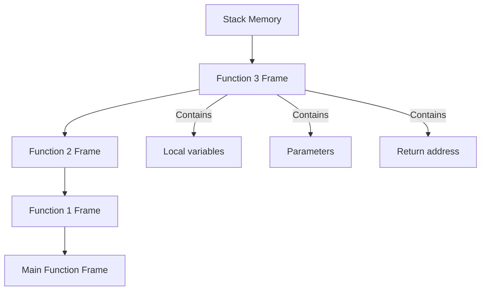
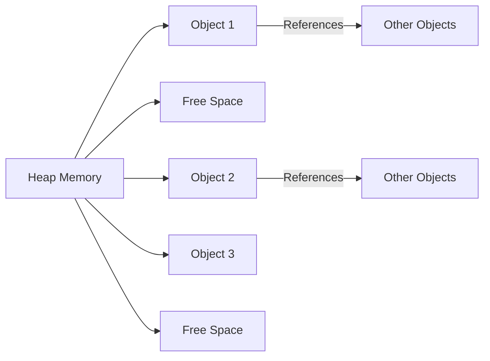

Think of your computer's memory like organizing a busy restaurant kitchen. The stack is like the counter space right in front of you—limited but super fast for quick tasks like chopping vegetables. The heap is like the large storage room in the back—spacious and flexible but takes longer to access when you need something specific.

> **At a glance**
> - Stack memory operates on LIFO (Last In, First Out) principle for function calls and local variables
> - Heap memory provides dynamic allocation for objects that need to persist beyond function scope
> - Stack is faster but limited in size; heap is slower but offers flexible, larger storage
> - Stack automatically manages memory cleanup; heap requires manual or garbage-collected cleanup
> - Use stack for short-lived, predictable data; use heap for large or long-lived objects
> - Understanding both helps write more efficient and reliable programs

## Stack Memory: Fast and Organized

Stack memory works like a stack of plates in your kitchen—you always add to the top and remove from the top (LIFO principle). When a function gets called, it creates a new "frame" on the stack containing its local variables, parameters, and return address.

**Key characteristics:**
- Fixed size determined at compile time
- Extremely fast allocation and deallocation
- Automatic memory management
- Limited storage capacity (typically a few MB)
- Thread-local (each thread has its own stack)

**Example of stack usage:**
```c
void calculateSum() {
    int a = 10;        // Stored on stack
    int b = 20;        // Stored on stack  
    int result = a + b; // Stored on stack
    
    // When function ends, all variables automatically cleaned up
}
```

The stack excels at managing function calls and local variables because of its predictable access pattern. However, you'll encounter stack overflow errors if you exceed its size limits through deep recursion or large local arrays.



## Heap Memory: Flexible but Complex

Heap memory operates like a warehouse—you can store items of any size anywhere there's available space, but finding and retrieving them takes more effort. Languages like Java, Python, and C++ use heap allocation for objects that need to persist beyond their creating function's lifetime.

**Key characteristics:**
- Dynamic size allocation at runtime
- Slower allocation and access compared to stack
- Shared across all threads
- Requires explicit cleanup (or garbage collection)
- Can suffer from fragmentation over time

**Example of heap usage:**
```python
def create_user_list():
    users = []  # List object created on heap
    for i in range(1000):
        user = {"id": i, "name": f"User{i}"}  # Dictionary objects on heap
        users.append(user)
    
    return users  # List persists after function ends

# Heap objects remain accessible until garbage collected
user_data = create_user_list()
```

The heap's flexibility comes with trade-offs. Allocation requires finding suitable free memory blocks, and fragmentation can develop over time as objects of different sizes are allocated and deallocated.



## Stack vs Heap Comparison

| Aspect | Stack | Heap |
|--------|-------|------|
| **Speed** | Very fast | Slower |
| **Size** | Limited (MB) | Large (GB) |
| **Allocation** | Compile-time | Runtime |
| **Cleanup** | Automatic | Manual/GC |
| **Access Pattern** | LIFO | Random |
| **Thread Safety** | Thread-local | Shared |
| **Fragmentation** | None | Possible |

## When to Use Which

**Choose stack memory for:**
- Local variables and parameters
- Function call management
- Small, fixed-size data
- Short-lived objects
- Performance-critical code sections

**Choose heap memory for:**
- Dynamic data structures (lists, trees, graphs)
- Objects that outlive their creating function
- Large data allocations
- Objects shared between functions/threads
- Variable-sized data determined at runtime

```c++
// Stack allocation - fast, automatic cleanup
void processOrder() {
    Order localOrder;  // Stack allocated
    localOrder.process();
    // localOrder automatically destroyed when function ends
}

// Heap allocation - persists beyond function scope
Customer* createCustomer(string name) {
    Customer* customer = new Customer(name);  // Heap allocated
    return customer;  // Caller must delete when done
}
```

## Design Trade-offs

The choice between stack and heap allocation reflects fundamental programming trade-offs:

**Performance vs Flexibility:** Stack offers predictable, fast access but limits what you can do. Heap provides flexibility but with performance costs.

**Memory Management:** Stack handles cleanup automatically but restricts object lifetimes. Heap allows complex object relationships but requires careful memory management.

**Concurrency:** Stack memory is inherently thread-safe since each thread has its own stack. Heap memory is shared and requires synchronization for thread safety.

## Questions

1. **What happens when you exceed stack memory limits?**
2. **How does garbage collection work with heap-allocated objects?**

Understanding stack versus heap memory allocation helps developers write more efficient programs by choosing the appropriate memory model for each use case. Stack excels at managing short-lived, predictable data with automatic cleanup, while heap provides the flexibility needed for complex, long-lived objects at the cost of manual memory management and slower access times.

<!-- Subtopic selection rationale: 
1. Stack Memory - Core concept covering LIFO principle, function frames, and automatic management
2. Heap Memory - Dynamic allocation, object persistence, and manual management concerns  
3. Comparison Table - Direct contrasting of key characteristics for decision making
4. Usage Guidelines - Practical advice for choosing appropriate allocation strategy
These four subtopics partition the problem space without overlap and provide actionable guidance for developers.
-->