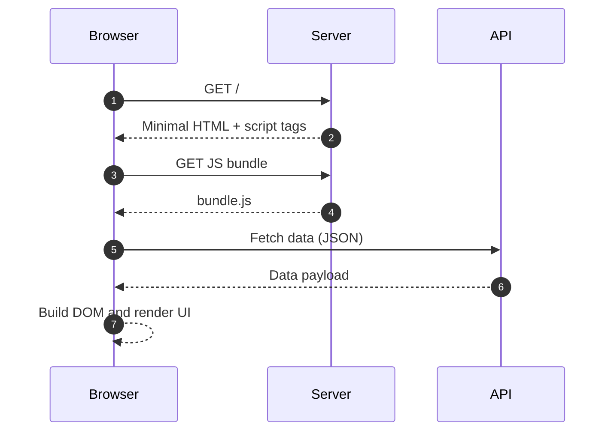
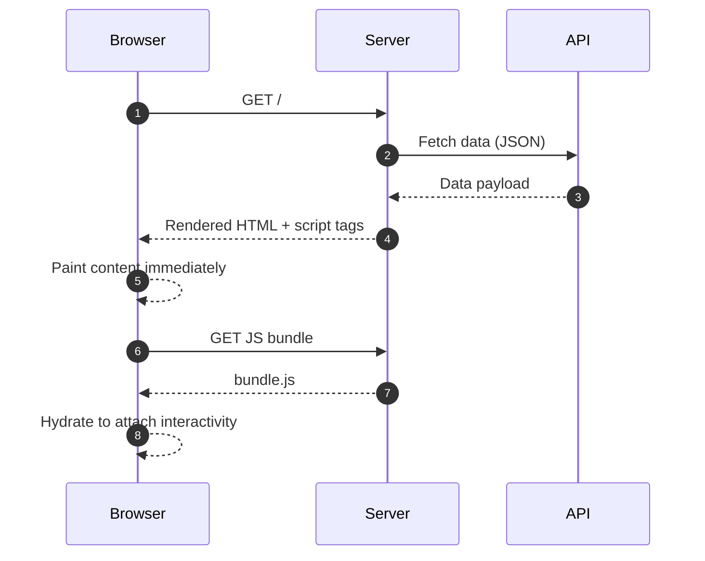

When you visit a website, the browser displays a fully interactive page. But have you ever wondered where that HTML comes from? In modern web development, there are two main strategies for generating the HTML you see: **Server-Side Rendering (SSR)** and **Client-Side Rendering (CSR)**. These aren't competing technologies—they're different approaches to the same problem, and understanding when to use each one can dramatically improve how your web application performs.

This article breaks down how both approaches work, their trade-offs, and when each makes sense for your project.

## How Client-Side Rendering Works

Imagine ordering furniture that arrives flat-packed. You get all the pieces, but you have to assemble it yourself. That's essentially what happens with Client-Side Rendering.

When you visit a CSR application, here's what happens step by step:

1. **The browser requests a page** from the server
2. **The server sends back a minimal HTML file**—often just a shell with a `

` and some script tags
3. **The browser downloads JavaScript bundles**—sometimes several megabytes of code
4. **JavaScript executes** and takes control of the page
5. **The framework (React, Vue, Angular) builds the UI** by manipulating the DOM
6. **Data is fetched from APIs** to populate the content
7. **The page becomes interactive**

The key insight: the browser does all the heavy lifting. The HTML you initially receive is nearly empty—the JavaScript running in your browser constructs the entire page dynamically.

Popular CSR frameworks include **Create React App**, **Vue CLI**, and **Angular**. Single-Page Applications (SPAs) built with these tools typically use CSR exclusively.

## How Server-Side Rendering Works

Now imagine ordering furniture that arrives fully assembled. You open the box, and it's ready to use immediately. That's SSR.

With Server-Side Rendering, the flow looks different:

1. **The browser requests a page** from the server
2. **The server executes application code** (React, Vue, etc.) on the server itself
3. **The server generates fully-formed HTML**—complete with all the content
4. **HTML is sent to the browser**
5. **The browser displays the page immediately**—users can see and read content right away
6. **JavaScript downloads in the background**
7. **The page "hydrates"**—JavaScript attaches event listeners and makes the page interactive

The critical difference: the server does the initial rendering work. By the time HTML reaches your browser, the page structure and content are already there.

Modern SSR frameworks include **Next.js** (React), **Nuxt** (Vue), **SvelteKit** (Svelte), and **Remix**. These frameworks make SSR straightforward and often combine it with other rendering strategies.

## The Mental Model: Who Builds the Page?

Here's the simplest way to think about the difference:

- **CSR**: The browser builds the page using JavaScript
- **SSR**: The server builds the page and sends ready-to-display HTML

This fundamental difference cascades into performance characteristics, user experience, and infrastructure requirements. When the server does the work, users see content faster but your server does more. When the browser does the work, your server is simpler but users wait longer for that initial view.

### Request/response flows at a glance

**CSR sequence**

**SSR sequence**

## Pros and Cons of Client-Side Rendering

**Advantages:**

- **Rich interactive applications**: Perfect for complex dashboards, admin panels, and tools that feel more like desktop apps
- **Smooth navigation**: Once loaded, moving between pages is instant—no server round-trips needed
- **Reduced server load**: Your server just serves static files; no rendering computation required
- **Developer experience**: Simpler backend architecture; your API and frontend are cleanly separated

**Disadvantages:**

- **Slower initial load**: Users stare at a blank screen or loading spinner while JavaScript downloads and executes
- **SEO challenges**: Search engine crawlers might not execute JavaScript, so they miss your content
- **Heavy JavaScript bundles**: Large apps can ship megabytes of code that mobile users must download
- **Performance on slow devices**: Older phones struggle to execute complex JavaScript quickly

## Pros and Cons of Server-Side Rendering

**Advantages:**

- **Faster first paint**: Users see content immediately—no waiting for JavaScript to build the page
- **Better SEO**: Search engines receive fully-rendered HTML with all your content visible
- **Content visible without JavaScript**: Even if JavaScript fails to load, users can still read the page
- **Improved performance on low-end devices**: The server handles the rendering work, not the user's phone

**Disadvantages:**

- **Higher server load**: Your server must render HTML for every request, which requires more CPU and memory
- **More complex infrastructure**: You need a Node.js server (or similar) running your application code
- **Potential latency**: If your server is geographically far from the user, they'll wait longer
- **Full page reloads**: Traditional SSR means navigating between pages requires new server requests

## Real-World Use Cases

**When Client-Side Rendering Makes Sense:**

- **SaaS dashboards**: Applications like analytics tools, project management systems, or CRM interfaces
- **Internal tools**: Admin panels and employee-facing applications where SEO doesn't matter
- **Highly interactive apps**: Real-time collaboration tools, data visualization platforms, or mapping applications
- **Applications behind authentication**: If users must log in first, search engines can't see the content anyway

**When Server-Side Rendering Makes Sense:**

- **Marketing websites**: Company homepages, landing pages, and promotional sites need fast loads and SEO
- **E-commerce product pages**: Search visibility and fast content display directly impact revenue
- **Blogs and content sites**: You want search engines to index your articles and users to read immediately
- **Public-facing pages**: Anything that benefits from social media previews or search engine rankings

## The Modern Hybrid Approach

Here's where it gets interesting: you don't have to choose just one. Modern frameworks embrace hybrid rendering strategies that combine the best of both worlds.

**Static Site Generation (SSG)**: Generate HTML at build time, not request time. Perfect for content that doesn't change often—think blog posts or documentation. Next.js and Gatsby excel at this.

**Incremental Static Regeneration (ISR)**: Generate static pages but rebuild them in the background when data changes. You get static speed with dynamic freshness.

**Hydration**: Send server-rendered HTML first, then "hydrate" it with JavaScript to make it interactive. Users see content immediately but get full app functionality after JavaScript loads.

**Edge Rendering**: Run SSR at CDN edge locations close to users, eliminating geographic latency. Cloudflare Workers and Vercel Edge Functions enable this.

The industry trend is clear: frameworks are moving toward **flexible rendering per route**. Your homepage might use SSR for fast loads and SEO, your dashboard uses CSR for rich interactivity, and your blog posts use SSG for maximum performance. Next.js and Remix make these decisions page-by-page, not application-wide.

## Conclusion

SSR and CSR are two different strategies for generating HTML, each optimized for different needs. CSR shifts work to the browser, enabling rich interactions but slower initial loads. SSR shifts work to the server, enabling fast content display and better SEO but requiring more infrastructure.

Modern web development isn't about picking one strategy forever—it's about choosing the right rendering approach for each part of your application. Understanding the trade-offs helps you make informed decisions that balance user experience, performance, and operational complexity.

The frameworks have evolved to make these decisions easier. Whether you're building a content site or a complex application, you now have tools that let you mix rendering strategies to get the best outcome for your users.

## Questions

Test your understanding with these questions:

1. What is the fundamental difference between who renders the page in SSR vs CSR?
2. Why might an e-commerce product page benefit from SSR over CSR?
3. Can you name two modern frameworks that support both SSR and CSR in the same application?
4. What is "hydration" and why is it important in SSR applications?

<!--
Selection rationale: Subtopics chosen based on foundational understanding needed for SSR/CSR:
1. CSR mechanics - core flow developers must understand
2. SSR mechanics - parallel comparison to CSR
3. Mental model - critical for intuitive grasp
4. Trade-offs (pros/cons) - practical decision-making
5. Use cases - real-world application
6. Hybrid approaches - industry direction and current best practices

Primary sources: Official Next.js, Nuxt, and React documentation; web.dev performance guides.
-->
