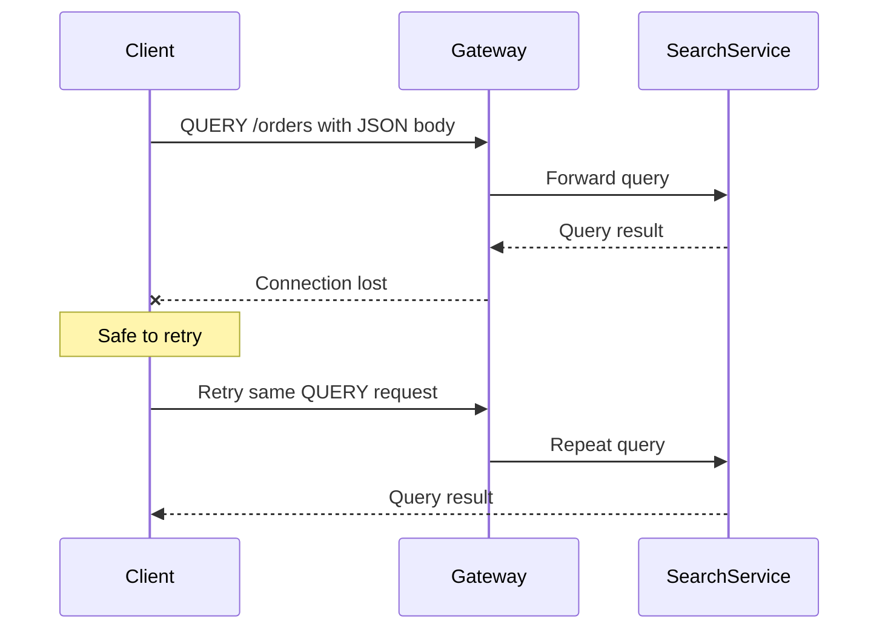

Suppose you are designing an API that lets users search millions of orders.

A simple search might fit comfortably inside a URL:

```http
GET /orders?status=PAID&country=VN&limit=20 HTTP/1.1
Host: api.example.com
```

But the requirements rarely stay simple.

Soon, users want nested filters, full-text search, multiple date ranges, sorting rules, field selection, aggregations, and access-control conditions.

The request starts looking like this:

```json
{
  "filter": {
    "status": ["PAID", "REFUNDED"],
    "createdAt": {
      "from": "2026-01-01T00:00:00Z",
      "to": "2026-06-30T23:59:59Z"
    },
    "customer": {
      "countries": ["VN", "SG"],
      "minimumLifetimeValue": 1000
    }
  },
  "sort": [
    {
      "field": "createdAt",
      "direction": "DESC"
    }
  ],
  "fields": [
    "id",
    "status",
    "customerName",
    "totalAmount"
  ],
  "page": {
    "size": 100
  }
}
```

Putting all of this in a query string is awkward. It makes URLs long, difficult to read, difficult to encode, and likely to expose query data through logs.

So many teams create an endpoint like this:

```http
POST /orders/search HTTP/1.1
Host: api.example.com
Content-Type: application/json

{
  "filter": {
    "status": ["PAID", "REFUNDED"]
  }
}
```

It works.

But it also creates a semantic lie.

The request does not create an order, modify an order, or initiate a state-changing command. It only reads data. Yet the API uses `POST`, a method that does not tell clients, gateways, caches, or monitoring tools that the operation is safe to repeat.

RFC 10008 introduces a better answer: the HTTP `QUERY` method.

## The Problem with GET

`GET` is the natural method for retrieving data.

It has several valuable properties:

* It is safe: the client is not requesting a state change.
* It is idempotent: repeating the request should have the same intended effect.
* It works well with browsers, gateways, caches, proxies, and observability tools.
* The request can be bookmarked or shared through its URI.

For ordinary filtering, `GET` remains the right choice.

```http
GET /products?category=laptop&brand=apple HTTP/1.1
Host: api.example.com
```

The problem appears when the query becomes too large or too structured for a URI.

### URLs have practical size limits

HTTP does not define one small universal maximum URL length, but requests pass through browsers, reverse proxies, API gateways, web servers, security appliances, logging systems, and application frameworks.

Each component can impose its own limit.

A request accepted by your application server might be rejected earlier by a gateway.

This makes long query strings operationally fragile.

### Structured queries are difficult to encode

Nested filters are natural in JSON:

```json
{
  "price": {
    "minimum": 100,
    "maximum": 500
  },
  "categories": ["book", "course"],
  "excludeOutOfStock": true
}
```

The same structure becomes harder to understand once converted into query parameters:

```text
?price.minimum=100
&price.maximum=500
&categories=book
&categories=course
&excludeOutOfStock=true
```

For more complicated query languages, the encoding becomes even less pleasant.

### URLs are frequently logged

Request URIs commonly appear in:

* proxy access logs;
* browser history;
* analytics platforms;
* monitoring systems;
* tracing attributes;
* bookmarks;
* copied links.

Authentication secrets should never be placed in query parameters, but even ordinary business filters may contain information that should not be broadly recorded.

Moving the query into request content does not make it automatically confidential, but it reduces exposure through systems that routinely record URLs.

### GET request bodies have no defined general semantics

Technically, an HTTP message can contain content in situations where an application chooses to send it.

However, a body attached to `GET` does not have generally defined semantics. Different clients, servers, frameworks, and intermediaries may ignore it, reject it, strip it, or process it inconsistently.

This is not a dependable foundation for a public API.

## Why POST Became the Workaround

`POST` supports request content and is widely implemented.

That makes it an easy escape hatch:

```http
POST /products/search HTTP/1.1
Host: api.example.com
Content-Type: application/json

{
  "brands": ["Apple", "Lenovo"],
  "minimumMemoryGb": 16,
  "sort": "price"
}
```

GraphQL APIs commonly use POST for similar reasons. Search APIs, reporting endpoints, analytics systems, and database-style APIs do the same.

The server understands that this is a read operation.

The problem is that generic HTTP infrastructure does not.

Without application-specific knowledge, a client cannot safely assume that retrying a POST request will avoid duplicate state changes.

A gateway cannot infer from the method alone that the operation is read-only.

An engineer looking at access logs sees `POST` and must inspect the endpoint or documentation to understand its behavior.

The API works, but some of the meaning has been moved out of HTTP and into tribal knowledge.

## What QUERY Adds

A `QUERY` request asks the target resource to process the enclosed content and return the result in a safe and idempotent manner.
This newly defined method was released under [RFC 10008](https://www.rfc-editor.org/info/rfc10008/) as a standardized way to express complex read operations.

Example of a complex product search could look like this:

```http
QUERY /products HTTP/1.1
Host: api.example.com
Content-Type: application/json
Accept: application/json

{
  "brands": ["Apple", "Lenovo"],
  "minimumMemoryGb": 16,
  "sort": [
    {
      "field": "price",
      "direction": "ASC"
    }
  ]
}
```

The request resembles POST because the query is carried in the message content.

Its semantics resemble GET because the operation is explicitly safe and idempotent.

This is the missing middle.

| Property                              |       GET |    QUERY |                          POST |
| ------------------------------------- | --------: | -------: | ----------------------------: |
| Intended for retrieval                |       Yes |      Yes |               Not necessarily |
| Request content has defined semantics |        No |      Yes |                           Yes |
| Safe                                  |       Yes |      Yes |               Not necessarily |
| Idempotent                            |       Yes |      Yes |               Not necessarily |
| Response can be cached                |       Yes |      Yes | Limited and context-dependent |
| Suitable for large structured queries |      Poor |      Yes |                           Yes |
| Broad infrastructure support          | Excellent | Emerging |                     Excellent |

## Safe Does Not Mean “No Side Effects at All”

HTTP safety is often misunderstood.

A safe request means that the client is not requesting a change to the target resource's state.

The server may still perform incidental work:

* write an access log;
* increment a metric;
* populate a cache;
* create a trace;
* record billing information for consumed compute;
* generate a temporary resource representing the query result.

The important point is that the requested business operation is read-only.

For example, this would be valid behavior:

```http
QUERY /reports HTTP/1.1
Content-Type: application/json

{
  "type": "monthly-revenue",
  "month": "2026-06"
}
```

The server may calculate the report and temporarily store the result. But the client did not ask it to modify revenue records, customer accounts, or application state.

## Why Idempotency Matters

Imagine that a client sends a request and the connection closes before the response arrives.

The client now has a difficult question:

> Did the server process the request?

For a state-changing POST request, automatically retrying may be dangerous.

```http
POST /payments HTTP/1.1
```

If the first request succeeded but the response was lost, retrying could create a duplicate payment unless the API implements its own idempotency mechanism.

A `QUERY` request has a different contract.

Because it is idempotent, the client can repeat it after a network failure without worrying that the requested operation will progressively change resource state.



This is especially useful for:

* mobile networks;
* cross-region requests;
* service-to-service calls;
* long-running searches;
* analytics queries;
* applications with automatic retry policies.

Idempotency does not guarantee that the returned data is identical forever. The underlying database may change between requests.

It means repeating the request has the same intended effect: retrieving information rather than applying another mutation.

## Content-Type Is Required

A QUERY body is not just an untyped collection of bytes.

Its media type defines how the target resource should interpret it.

```http
QUERY /orders HTTP/1.1
Content-Type: application/json
```

A different API could support another query language:

```http
QUERY /documents HTTP/1.1
Content-Type: application/jsonpath
```

Or a controlled internal data service could accept a SQL-oriented media type:

```http
QUERY /analytics HTTP/1.1
Content-Type: application/sql

SELECT region, SUM(revenue)
FROM monthly_sales
GROUP BY region
```

This does not mean exposing unrestricted SQL over the public internet is a good design. It demonstrates that QUERY is not tied to JSON or to one query language.

The resource decides which media types it understands.

A server should reject a request when:

* `Content-Type` is missing;
* the declared content type is unsupported;
* the content does not match the declared type;
* the query is syntactically valid but cannot be processed.

Typical responses could include:

| Situation                              |              Possible status |
| -------------------------------------- | ---------------------------: |
| Missing or invalid metadata            |            `400 Bad Request` |
| Unsupported query media type           | `415 Unsupported Media Type` |
| Valid format but invalid query meaning |  `422 Unprocessable Content` |
| Unsupported response representation    |         `406 Not Acceptable` |

## Advertising Support with Accept-Query

A server can tell clients which query formats it accepts using the `Accept-Query` response header.

```http
HTTP/1.1 200 OK
Accept-Query: application/json, application/jsonpath
```

This is useful for API discovery and capability negotiation.

A client could first make an `OPTIONS` request:

```http
OPTIONS /documents HTTP/1.1
Host: api.example.com
```

The server could answer:

```http
HTTP/1.1 204 No Content
Allow: GET, HEAD, QUERY, OPTIONS
Accept-Query: application/jsonpath
```

The client now knows that:

* the resource supports QUERY;
* the supported query representation is JSONPath;
* sending an arbitrary JSON body may not be accepted.

## QUERY Responses Can Be Cached

Because QUERY is safe, its responses can be cached.

But caching is more complicated than with GET.

For GET, the URI is normally a central part of the cache key:

```http
GET /products?brand=Apple
```

For QUERY, two requests can have the same URI but different bodies:

```http
QUERY /products

{"brand": "Apple"}
```

```http
QUERY /products

{"brand": "Lenovo"}
```

A cache that considers only the method and URI would incorrectly treat these as the same query.

Therefore, a QUERY cache key must incorporate:

* the request content;
* its content type;
* relevant request metadata;
* normal HTTP cache-selection fields.

Conceptually:

```text
cache-key =
    method
    + target-uri
    + content-type
    + normalized-request-content
    + relevant-vary-headers
```

Normalizing content is also difficult.

These JSON documents may be semantically equivalent:

```json
{"brand":"Apple","minimumMemory":16}
```

```json
{
  "minimumMemory": 16,
  "brand": "Apple"
}
```

A byte-for-byte cache key treats them as different.

A JSON-aware cache might canonicalize property order and whitespace, but incorrect normalization can produce false matches and return the wrong result.

The safest first implementation may be:

1. Do not cache QUERY responses at shared infrastructure.
2. Let the application implement a query-result cache using a canonical query representation.
3. Add generic cache support only after every intermediary is verified.

## Giving the Query or Result a URI

One benefit of GET is that the query itself already has a URI.

You can bookmark it:

```text
/products?brand=Apple&minimumMemory=16
```

A body-based QUERY request does not automatically provide a shareable URI.

The specification provides mechanisms for the server to assign one.

### Content-Location for the result

A response can identify a retrievable representation of the result:

```http
HTTP/1.1 200 OK
Content-Type: application/json
Content-Location: /query-results/f42c9a

{
  "items": [...]
}
```

The client may later retrieve that result:

```http
GET /query-results/f42c9a HTTP/1.1
```

### Location for an equivalent query resource

The server can also assign a URI representing the query itself:

```http
HTTP/1.1 200 OK
Location: /saved-queries/81ad30
Content-Type: application/json

{
  "items": [...]
}
```

A later GET to that URI can repeat or represent the original query without resending its content.

This is useful for:

* saved searches;
* shareable reports;
* asynchronous query workflows;
* expensive analytics results;
* switching repeated requests back to ordinary GET.

## CORS Will Require a Preflight Request

Browser support has another practical consequence.

`QUERY` is not a CORS-safelisted method.

A cross-origin browser request will therefore require a preflight:

```http
OPTIONS /products HTTP/1.1
Origin: https://frontend.example.com
Access-Control-Request-Method: QUERY
Access-Control-Request-Headers: content-type
```

The server must explicitly allow it:

```http
HTTP/1.1 204 No Content
Access-Control-Allow-Origin: https://frontend.example.com
Access-Control-Allow-Methods: GET, QUERY, OPTIONS
Access-Control-Allow-Headers: Content-Type
```

Teams adopting QUERY must check more than application controllers.

They must verify:

* browser Fetch support;
* CORS configuration;
* API gateways;
* web application firewalls;
* reverse proxies;
* load balancers;
* service meshes;
* tracing agents;
* metrics systems;
* client SDK generators;
* API documentation tools;
* test clients.

A protocol feature is useful only when the full request path preserves it.

## A Possible Spring-Style Implementation

Until frameworks expose dedicated annotations, a server may need a generic method mapping.

Conceptually, a Spring controller might look like this:

```java
@RestController
@RequestMapping("/orders")
public class OrderQueryController {

    @RequestMapping(
        method = RequestMethod.QUERY,
        consumes = MediaType.APPLICATION_JSON_VALUE,
        produces = MediaType.APPLICATION_JSON_VALUE
    )
    public OrderSearchResponse queryOrders(
            @RequestBody OrderSearchQuery query) {

        return orderSearchService.search(query);
    }
}
```

Actual framework support will depend on the version and HTTP stack.

Even when a framework accepts a custom method, the surrounding infrastructure may still reject it. That is why early adoption should start with controlled service-to-service environments rather than immediately exposing it through every public client.

## When Should You Use QUERY?

QUERY is a strong fit when all of the following are true:

* the operation is read-only;
* the input is too complex or too large for a practical URI;
* the request needs structured content;
* automatic retries are useful;
* method semantics should clearly communicate safety;
* the client and infrastructure support the method.

Good candidates include:

* advanced search endpoints;
* reporting APIs;
* analytics queries;
* GraphQL-style read operations;
* log-search systems;
* document queries;
* complex filtering and aggregation;
* internal data-platform APIs.

## When Should You Keep GET?

Do not replace ordinary GET endpoints merely because QUERY is newer.

Keep GET when:

* parameters are short and simple;
* the URI should be shareable;
* browser and CDN compatibility is important;
* standard caching is valuable;
* HTML forms or ordinary links should initiate the request;
* broad client support matters more than complex input.

This remains good API design:

```http
GET /users/42
GET /orders?status=PAID
GET /articles?page=2
```

QUERY solves a specific problem. It does not make GET obsolete.

## When Is POST Still Correct?

Use POST when the operation requests a state change or has command-like semantics.

Examples include:

```http
POST /orders
POST /payments
POST /jobs
POST /emails/send
```

POST can also remain a reasonable compatibility fallback for complex reads when clients or infrastructure do not support QUERY.

In that case, document the behavior clearly and consider safeguards such as:

* application-level retry rules;
* explicit cache handling;
* separate `/search` or `/query` resources;
* idempotency keys where the operation is not truly read-only;
* SDK methods that hide transport differences.

Protocol purity should not make a production system unreliable.

## Closing Thoughts

The HTTP QUERY method does not make existing search APIs suddenly incorrect.

`GET` remains the best method for simple, addressable retrieval. `POST` remains the practical fallback wherever infrastructure support is incomplete.

QUERY matters because it gives complex reads an explicit semantic home.

It combines:

* structured request content;
* safe behavior;
* idempotent retries;
* potential cacheability;
* clearer API intent.

The difficult part will not be writing a controller that recognizes a new method.

The difficult part will be getting browsers, frameworks, gateways, proxies, caches, security systems, SDKs, and engineering conventions to agree on it.

That is how protocol adoption usually works: the standard is published first, but the ecosystem decides when it becomes ordinary.
